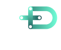
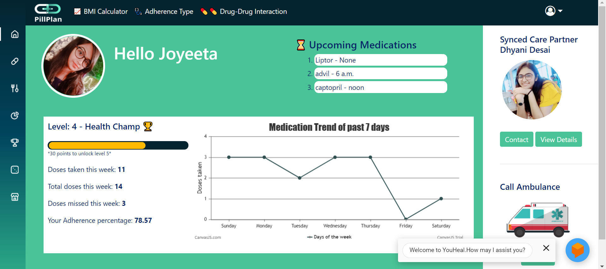

# PillPlan-Medicine-Adherence

<div id="top"></div>

<!-- TABLE OF CONTENTS -->
<details>
  <summary>Table of Contents</summary>
  <ol>
    <li>
      <a href="#about-the-project">About The Project</a>
      <ul>
        <li><a href="#built-with">Built With</a></li>
      </ul>
    </li>
    <li>
      <a href="#getting-started">Getting Started</a>
      <ul>
        <li><a href="#prerequisites">Prerequisites</a></li>
        <li><a href="#installation">Installation</a></li>
      </ul>
    </li>
    <li><a href="#projecttree">Project Tree</a></li>
    <li><a href="#contributors">Contributors</a></li>
    <li><a href="#demovideo">Demo Video Link</a></li>
   
  </ol>
</details>

<div align="center">
  

  <h3 align="center">Pill Plan - All-in-one Medication Solution</h3>
</div>

<!-- ABOUT THE PROJECT -->
# About The Project



Medication nonadherence is a complex problem that stems from several factors including the healthcare system, disease-related conditions, therapy-related factors, socioeconomic status, and the patients themselves. Medication nonadherence is a growing concern to clinicians, healthcare systems, and other stakeholders (eg, payers) because of mounting evidence that it is prevalent and associated with adverse outcomes and higher costs of care.

Hence our solution for  ensuring medical adherence should include the following points:

Here's why:
* Data Analytics on given dataset to find the category of population falling into the category of non-adherence
* Smart Pill Reminders and Refill Alerts 
* AI/ML induced smart chatbots for Doctor Appointment Schedule and Pill Reminder with Google Calendar
* Predicting the type of non-adherence using predictive analytics and behavioral technology can be considered to give patients the personalized support they need to achieve greater adherence
* Creating an engaging UI/UX experience (visually interactive for minorities and illiterate population to understand)
* Synced Care Partner system with gps tracking using Google Maps
* Various drug helper tools like Food-Drug interaction checker, Food-Allergy checker and drug-drug interaction checker
* Tracking the progress of patients and their peers progress to  identify where they have reached in their treatment journey through gamification.
* Imparting basic knowledge regarding medicine storage, medical equipment usage , false assumptions through various gamification approach .
* Reward system based engaging portal that keeps the patients motivated to complete their medication journey on time.


# Built With

Major Frameworks, Libraries and Algorithms used

Front End
* HTML,CSS,Javascript
* Bootstrap,Ajax,JQuery etc.

Framework
* Django
* PHP

Machine Learning Algorithms
* Naive Bayes Classifier
* Support Vector Machines
* XGBoost Algorithms
* KNN 

Other Algorithms
* Dijkstra's Algorithm and Shortest Time path  Algorithms
* Content-Based Recommendation System
* Deep Learning Posture Detection Algorithms
* NLP Sentiment Analysis Model

Other tools
* Tensorflow,Open CV
* GTTS module, Google Geolocation
* Python ML,DL libraries
* Beautiful Soup , Web Scraping 

Hardware Component
* Arduino simulation using Tinkercad


<p align="right">(<a href="#top">back to top</a>)</p>


<!-- GETTING STARTED -->
# Installation

* Clone the repository using the following command
```sh
git clone https://github.com/joyeetadey/PillPlan-Medicine-Adherence.git
```
* Create a virtal envirnoment 
```sh
virtualenv venv
venv\Scripts\activate
```
* Go to the directory and install the requirements
```sh
pip install -r requirements.txt
```
* Start the django server
```sh
python manage.py makemigrations
python manage.py migrate
python manage.py runserver
```
# Prerequisites
* To start the calendar API and google maps API you need your API ke and Client ID

<p align="right">(<a href="#top">back to top</a>)</p>


# Project tree

.
 * [Readme.md](./README.md)
 * [Data Analytics](./Data-Analytics)
 * [IOT-Aduino-medicine-reminder](./IOT-Aduino-medicine-reminder)
 * [Mediplus-Pharmacy](./Mediplus-Pharmacy)
 * [optum](./optum)
   * [optum](./optum/optum)
   * [users](./optum/users)
      * [models](./optum/users/models)
      * [static](./optum/users/static)
      * [templates](./optum/users/templates)
        * [users](./optum/users/templates/users)
        * [games](./optum/users/templates/games)
   * [manage.py](./optum/manage.py)
 * [file_in_root.ext](./file_in_root.ext)
 * [README.md](./README.md)
 * [dir3](./dir3)

<p align="right">(<a href="#top">back to top</a>)</p>


<!-- CONTACT -->
# Contributors

* <h4 align="left"><a href="https://github.com/joyeetadey">Joyeeta Dey</a></h4>
* <h4 align="left"><a href="https://github.com/dhyanid13">Dhyani Desai</a></h4>
* <h4 align="left"><a href="https://github.com/KarmanyaT28">Karmanya Tyagi</a></h4>

<p align="right">(<a href="#top">back to top</a>)</p>


# Demo Video Link

https://drive.google.com/file/d/1PD-_MsMhHz6NZK4fb_Fei8ZnfEHNE_Ai/view?usp=sharing
